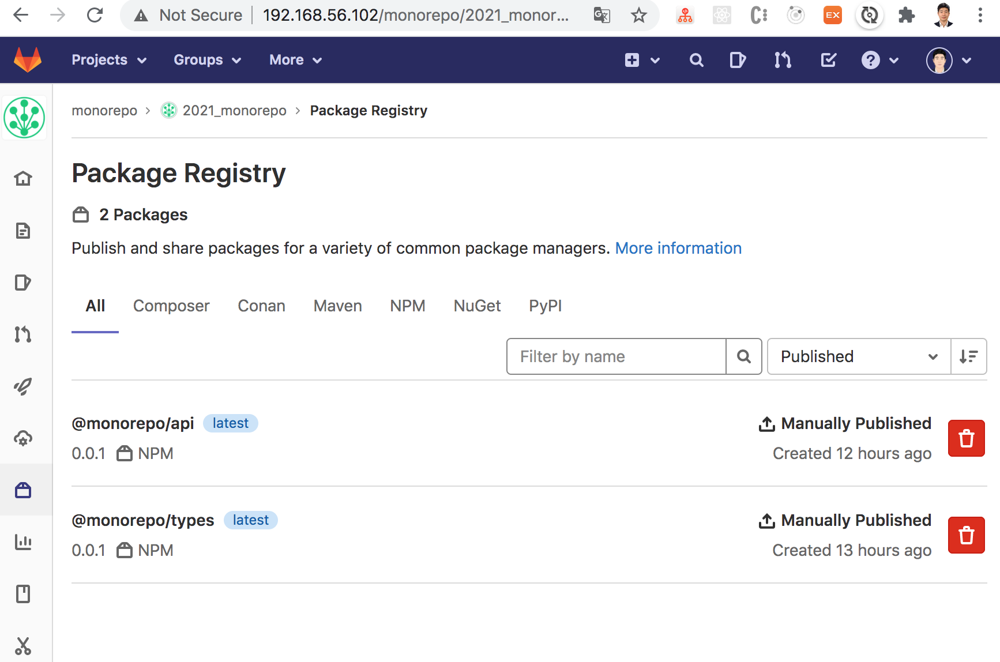

## 개념증명(Proof of Contept) : 모노리포 및 프라이빗 NPM 저장소 운영 

<br/>

부제: full-cycle 개발(frontend / backend + 테스트/빌드/배포)을 위한 모노리포 구현하기 

<br/>

> 프론트엔드,백엔드 학습을 위해 여러 미니 프로젝트를 시도 하는 중에   
> 프로젝트를 패키지로 묶어서 함께 관리하고 싶다는 생각이 들었습니다.     
>
> 이에 gitlab npm packages + lerna + scripty + @ 로 패키지를  
> 효과적으로 통합 관리하는 기법을 익히고자 본 미니 프로젝트를 시작하게 되었습니다. 
>

<br/>


목차 

1. 동기 (Motivation)

2. 프로젝트를 진행하며 새롭게 습득하게 된 것들  

3. 회 고 (Retrospective)

<br/>



<br/>

### 1. 동기 (Motivation)

<!-- #region 1 -->

<details open>
<summary>...(닫기)</summary>

<br/>

🔥 **_모노리포 프로젝트_** 를 시작하게 된 **_주요 동기_**:   


* __단일 진실 공급원(single source of truth)__: ... 

* __중앙 통제와 분산 실행 (centralized control and decentralized execution)__: ...

</details>

<br/>

### 2. 프로젝트를 진행하는 중에 새롭게 습득하게 된 것들  

<!-- #region 2 -->

<br/>

<details open>
<summary>..(전체닫기)</summary>

<br/>

🍀 프로젝트를 진행하는 과정 중에 습득한 **_기법들_** : 

* 상속을 통한 개발 도구 설정의 **_중앙 통제_** &nbsp; (tsconfig.json, .babelrc)

    <details open>
    <summary>..(닫기)</summary>

    <br>

    * 프로젝트 별로 세부 설정 내용이 크게 달라 지지 않는 **_타입스크립트 컴파일러, 바벨 트랜스파일러, eslinter_** 의 경우 설정 상속을 통해 중복을 상당부분 제거할 수 있으면서도 프로젝트 별 세부 설정이 가능합니다. 

        <br>

        ```json
        // 파일 경로: 2021_monorepo/subprojects/tsconfig.settings.json
        {
        "compilerOptions": {
            "module": "CommonJS",
            "types": [],
            "sourceMap": true,
            "target": "ES2018",
            "strict": true,
            "noUnusedLocals": true,
            "noUnusedParameters": true,
            "noImplicitReturns": true,
            "declaration": true,
            "outDir": "dist",
            "rootDir": "src"
        },
        "include": ["src"]
        }

        // 파일 경로: 2021_monorepo/subprojects/types/tsconfig.settings.json
        {
        "extends": "../tsconfig.settings.json", // 상속을 통해 공통되는 설정의 중복을 제거한다 
        "compilerOptions": {
            "composite": true,
            "outDir": "dist",
            "rootDir": "src"
        },
        "include": ["src"]
        }
        ```

        <br>

    </details>

* Package Iteration, Scoped Execution을 통한 일괄/분산 실행 (lerna, scripty)

    <details open>
    <summary>..(닫기)</summary>

    <br/>

    * lerna는 빌드/테스트/배포 등에 필요한 작업을 효과적으로 처리할 수 있도록 **_전체 패키지 일괄 실행_** 및 **_패키지별 분산 실행_** 이 가능한 환경을 제공합니다. 

        <br/>

        ```bash 
        // 일괄 실행을 위한 package.json 및 scripty
        $ yarn [작업명]

        // 파일경로(scripty 설정): 2021_monorepo/scripts/workspace/build.sh
        #!/usr/bin/env bash
        yarn tsc -b subprojects

        ```

    <br/>

    * lerna는 빌드/테스트/배포 등에 필요한 작업을 효과적으로 처리할 수 있도록 **_전체 패키지 일괄 실행_** 및 **_패키지별 분산 실행_** 이 가능한 환경을 제공합니다. 

        <br/>

        ```bash 
        // 분산 실행을 위한 lerna 명령어
        $ lerna run [작업명] --scope [패키지명]
        $ lerna exec '[실행 스크립트]' -- scope [패키지명]

        // 파일경로(scripty 설정): 2021_monorepo/scripts/subprojects/build.sh
        #!/usr/bin/env bash
        yarn tsc -b

        ```
    <br>

    </details>

* 라이브러리 (@microsoft/api-extractor 와 @microsoft/api-documentor)를 이용한 문서생성 자동화 

    <details open>
    <summary>..(닫기)</summary>

    * 라이브러리를 통한 api 명세 추출 및 자동 문서 생성 

        <br/>

        ```bash

        {
            "$schema": "https://developer.microsoft.com/json-schemas/api-extractor/v7/api-extractor.schema.json",
            "mainEntryPointFilePath": "<projectFolder>/lib/index.d.ts", "bundledPackages": [],
            "compiler": {
            },
            "apiReport": {
                "enabled": true
            },
            "docModel": {
                "enabled": true,
                "apiJsonFilePath": "<projectFolder>/../../temp/<unscopedPackageName>.api.json"
            },
            "dtsRollup": {
                "enabled": true,
                "untrimmedFilePath": "<projectFolder>/dist/<unscopedPackageName>-private.d.ts",
                "betaTrimmedFilePath": "<projectFolder>/dist/<unscopedPackageName>-beta.d.ts",
                "publicTrimmedFilePath": "<projectFolder>/dist/<unscopedPackageName>.d.ts"
            },
            "tsdocMetadata": {
            },
            "messages": {
                "compilerMessageReporting": {
                    "default": {
                        "logLevel": "warning"
                    }
                },
                "extractorMessageReporting": {
                    "default": {
                        "logLevel": "warning"
                    }
                },
                "tsdocMessageReporting": {
                    "default": {
                        "logLevel": "warning"
                    }
                }
            }
        }
        ```
        <br>

    </details>

* gitlab NPM packages repo를 통한 패키지 관리 

    <details open>
    <summary>..(닫기)</summary>

    <br/>

    * 24시간 이내 한번만 publish 가능한 Public NPM 리포지토리와는 달리 설치형 gitlab 서버의 package repo는 수시로 배포가 가능합니다. 

    <br/>

    ```ts

    // 설정 파일 경로: 2021_monorepo/subprojects/types/.npmrc

    @monorepo:registry=https://gitlab.com/api/v4/packages/npm/
    //gitlab.com/api/v4/packages/npm/:_authToken'="xxxxxxxxxxxxxxxxxxxxx"
    //gitlab.com/api/v4/projects/types/packages/npm/:_authToken'="xxxxxxxxxxxxxxxxxxxx"

    // 설정 파일 경로: 2021_monorepo/subprojects/types/package.json

    "publishConfig": {
        "@monorepo:registry": "http://192.168.56.102/api/v4/projects/01/packages/npm/"
    },

    ```

    </details>


</details>

<br/>

### 3. 회 고 (Retrospective)

<!-- #region 3 -->

<br/>

<details open>
<summary>..(닫기)</summary>

<br/>

︎︎︎︎✨︎ 프로젝트를 진행하면서 깨닫게 된 **_주관적인 경험_** : 

* ...


<br>

<br>

︎︎︎🌻︎ 다음 **_미니 프로젝트_** 를 통해  **_시도해 보고 싶은 것들_** : 

* ...

</details>

<br>

<br>

<!-- #endregion 5 -->

